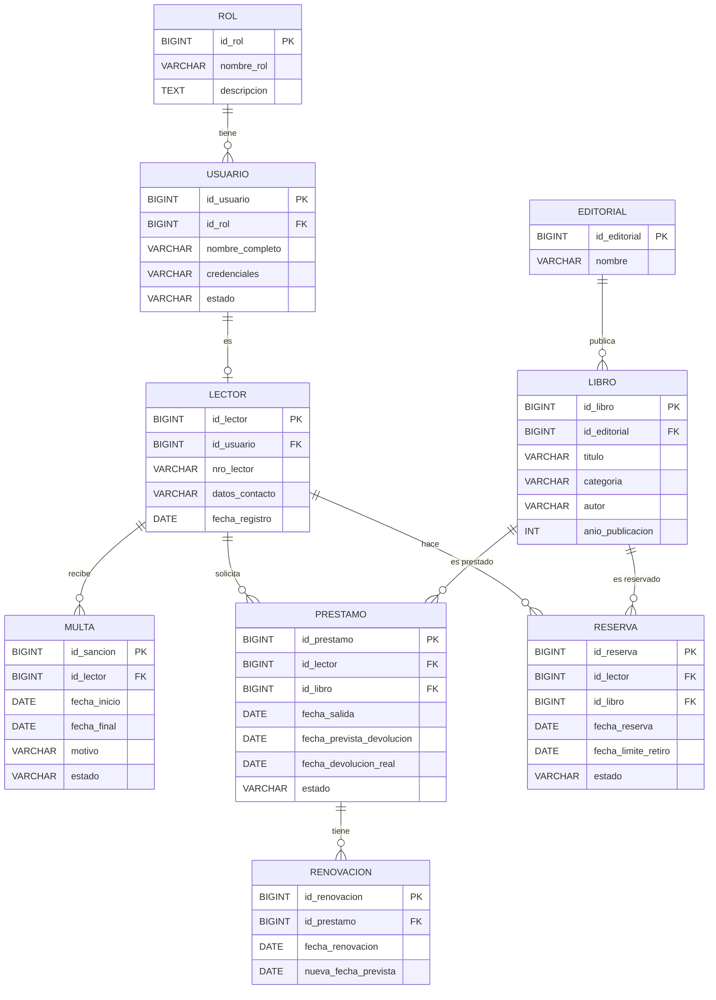

# BiblioSmart

Sistema académico full-stack para la gestión de catálogo bibliográfico, ejemplares físicos, préstamos, devoluciones, reservas, renovaciones y sanciones operativas de una biblioteca académica.x

## 1. Problema

Una biblioteca académica desea digitalizar su catálogo, ejemplares físicos, usuarios, préstamos, devoluciones, reservas y sanciones operativas. Actualmente se confunden los títulos bibliográficos con los ejemplares físicos y no existe trazabilidad fiable de quién tiene cada copia.

## 2. Objetivo del MVP

Construir un sistema web y móvil que gestione el catálogo bibliográfico y los ejemplares de forma individual, controle disponibilidad, préstamos, renovaciones y reservas, y entregue a cada usuario una vista clara de su situación.

## 3. Actores principales

- Bibliotecario — administra catálogo, ejemplares, préstamos y devoluciones.
- Administrador — gestiona parámetros, usuarios y reportes.
- Lector — consulta catálogo, reserva y revisa sus préstamos.
- Supervisor — consulta mora, sanciones y estadísticas.

## 4. Alcance inicial

El MVP obligatorio comprende los siguientes módulos:

- Usuarios
- Autores y editoriales
- Catálogo bibliográfico
- Ejemplares
- Préstamos
- Devoluciones
- Reservas
- Renovaciones
- Sanciones
- Dashboard y auditoría

El equipo puede mejorar la experiencia de usuario o agregar facilidades, pero no puede eliminar componentes del alcance funcional cerrado sin autorización docente.

## 5. Fuera de alcance

La ficha oficial de PA-12 no define una lista específica de exclusiones funcionales. Para no inventar requisitos, en esta versión v0.1 quedan fuera las funcionalidades adicionales que no formen parte del alcance funcional cerrado, salvo autorización docente.

Cualquier exclusión concreta adicional deberá registrarse como supuesto o decisión del proyecto y validarse con el docente. Spring AI se limita al uso acotado definido para BiblioSmart: puede resumir novedades del catálogo o responder preguntas sobre disponibilidad utilizando datos internos, pero no debe inventar títulos ni estados ni sustituir reglas de negocio deterministas.

## 6. Stack objetivo del semestre

- Backend: Java 21 + Spring Boot
- Base de datos: PostgreSQL + Flyway
- Web: React + TypeScript
- Móvil: React Native + TypeScript
- Pruebas API: Postman
- Contenedores: Docker / Docker Compose
- Versionado: Git + GitHub
- CI: GitHub Actions
- IA: Spring AI, únicamente como capacidad complementaria y acotada

## 7. Estado actual

Clase 01: comprensión del problema, actores, alcance, exclusiones, lenguaje inicial del dominio y backlog v0.1. Todavía no existe código de aplicación.

## 8. Documentación

- `docs/01-vision/vision-v0.1.md`
- `docs/01-vision/glossary-v0.1.md`
- `docs/02-requirements/backlog-v0.1.md`
- `docs/03-decisions/`

## 9. Regla de trabajo

Cada cambio importante debe ser comprensible, trazable y defendible. El repositorio es la fuente de verdad del proyecto.
## 10. Diagrama ER

## 11. Documentación Técnica
Toda la arquitectura del sistema, el modelo entidad-relación y la especificación de la API REST se encuentran documentados en nuestro espacio de trabajo:
[Ver Documentación Oficial en Notion] https://showy-strand-271.notion.site/BiblioSmart-Documentaci-n-del-Proyecto-3e761b4f4d07802483fbcccf3aacf47d?pvs=143
